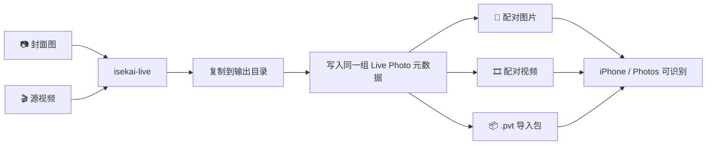

# 🎭 isekai-live

> **让一张静态封面，藏住另一段会动的真相。**
>
> 用你指定的图片做封面，用你指定的视频做动态内容，一条命令生成 **iPhone 可识别的 Live Photo 资产对**。

<p align="center">
  AI 图在外，真人视频在内。<br />
  预览像海报，长按才揭晓。
</p>

<p align="center">
  <a href="#-60-秒上手">🚀 快速开始</a> ·
  <a href="#你可以拿它做什么">🎨 创意灵感</a> ·
  <a href="#它和常见做法有什么不同">📊 对比</a> ·
  <a href="#常见问题">❓ FAQ</a>
</p>

---

## 为什么这个项目会让人想立刻试一下？

大多数 Live Photo 工具解决的是「怎么做出一张会动的照片」。

**isekai-live** 解决的是另一件更有传播感的事：

| 你看到的 | 实际播放的 | 传播效果 |
|----------|------------|----------|
| 📸 一张静态封面图 | ▶️ 长按后播放视频 | "封面骗人！" |
| 🎨 AI 生成的动漫形象 | 🎬 真人自拍视频 | "我变成二次元了！" |
| 🖼️ 精致的海报感照片 | 😂 搞怪日常片段 | "反差萌！" |

这意味着你可以把：

- **AI 生成图** + **真人自拍视频** → 朋友圈点赞收割机
- **插画封面** + **现场片段** → 小红书爆款素材
- **修复老照片** + **家庭祝福视频** → 长辈看了都感动
- **拟人宠物图** + **宠物日常片段** → 毛孩子"成精"了

**一句话说完：**

> **它不是修图工具，也不是视频剪辑器。它是一个把"反差感"打包进 Live Photo 的命令行工具。**

---

## 你可以拿它做什么？

### 🎭 1. AI 变身照

| 封面 | 长按后 |
|------|--------|
|  |  |
| AI 生成的动漫形象 | 你的真人自拍视频 |

**效果：** "我变成二次元了！"

### 🎪 2. 反差感内容

| 封面 | 长按后 |
|------|--------|
|  |  |
| 精致海报感照片 | 搞怪日常片段 |

**效果：** "封面高冷，点开沙雕"

### 📸 3. 回忆杀

| 封面 | 长按后 |
|------|--------|
|  |  |
| AI 修复的老照片 | 家人说话的视频 |

**效果：** 长辈看了都感动

### 🐱 4. 宠物整活

| 封面 | 长按后 |
|------|--------|
|  |  |
| 宠物拟人插画 | 宠物真实动态 |

**效果：** "毛孩子成精了！"

---

## 它和常见做法有什么不同？

| 方案 | 能生成 Live Photo | 能指定封面图 | 能指定动态视频 | 能导出可导入资产 | 操作成本 |
|------|:---:|:---:|:---:|:---:|:---:|
| iPhone 直接拍摄 | ✅ | ❌ | ❌ | ✅ | 低 |
| 相册/快捷指令拼装 | ⚠️ 看方案 | ⚠️ | ⚠️ | ⚠️ | 中 |
| 手动折腾元数据 | ✅ | ✅ | ✅ | ⚠️ | 高 |
| **isekai-live** | **✅** | **✅** | **✅** | **✅** | **低** |

**核心价值不是"能做 Live Photo"。**

而是：

- ✅ **封面和动态内容可以解耦** — 随便搭配
- ✅ **输出结果清晰可控** — 知道每个文件是什么
- ✅ **流程足够短** — 适合反复试素材
- ✅ **可脚本化** — 能接入自动化工作流

---

## 🚀 60 秒上手

### 1️⃣ 安装

```bash
# 克隆项目
git clone https://github.com/farmcan/isekai-gate.git
cd isekai-gate

# 安装依赖
pip install -e .
```

> **要求：** Python `>= 3.14` + macOS（推荐）

### 2️⃣ 准备素材

你只需要两份输入：

```text
assets/
├── cover.jpg      # 封面图 (jpg/png/heic)
└── clip.mov       # 视频 (mov/mp4)
```

**建议：**
- 📐 封面和视频尺寸匹配（推荐 1080x1920 竖屏）
- ⏱️ 视频时长 3-5 秒最佳

### 3️⃣ 一条命令生成

```bash
isekai-live \
  --cover assets/cover.jpg \
  --video assets/clip.mov \
  --output-dir output
```

成功后会输出：

```text
✅ Image: output/livephoto.jpg
✅ Video: output/livephoto.mov
✅ Package: output/livephoto.pvt
✅ Asset ID: xxxxxxxx-xxxx-xxxx-xxxx-xxxxxxxxxxxx
```

### 4️⃣ 导入到照片

在 macOS 上可直接打开 `.pvt` 包：

```bash
open output/livephoto.pvt
```

然后通过照片 App 同步到 iPhone，发朋友圈！

---

## 📋 命令说明

### 基本格式

```bash
isekai-live --cover <image> --video <video> --output-dir <dir>
```

### 参数表

| 参数 | 必填 | 说明 |
|------|------|------|
| `--cover` | ✅ | 封面图片路径 (jpg/png/heic) |
| `--video` | ✅ | 源视频路径 (mov/mp4) |
| `--output-dir` | ✅ | 输出目录 |

### 🎨 示例

```bash
# AI 图做封面，自拍视频做动态内容
isekai-live --cover ./samples/anime.jpg --video ./samples/self.mov --output-dir ./output

# 修复老照片做封面，家人祝福视频做动态内容
isekai-live --cover ./samples/family.jpg --video ./samples/blessing.mov --output-dir ./output

# 宠物插画做封面，宠物视频做动态内容
isekai-live --cover ./samples/cat.png --video ./samples/cat.mov --output-dir ./output
```

---

## 🏗️ 结构很简单，但很对

`isekai-live` 的价值，不在于复杂。

恰恰在于它把 Live Photo 生成这件事，收敛成了一个非常短的路径：



这套流程的重点是：

- ✅ **输入简单** — 一图一视频
- ✅ **处理直接** — 复制、配对、写元数据
- ✅ **输出明确** — 你能看到每个产物是什么
- ✅ **接入轻量** — 命令行即可集成到自己的工作流

---

## 🛡️ 为什么它可靠？

底层依赖 [`makelive`](https://github.com/RhetTbull/makelive) 来写入 Live Photo 所需元数据。

项目做的事情很克制：

```python
# 1. 生成一个唯一 asset_id
asset_id = str(uuid.uuid4())

# 2. 把图片和视频复制到输出目录
shutil.copy(cover, output_dir / "livephoto.jpg")
shutil.copy(video, output_dir / "livephoto.mov")

# 3. 为两者写入同一组 Live Photo 标识
makelive(image_path, asset_id)
makelive(video_path, asset_id)

# 4. 导出 .pvt 包用于照片导入
save_live_photo_pair_as_pvt(...)
```

也就是说，它不是"伪装成 Live Photo"。

它做的是一组 **Apple 生态能识别的配对资产**。

---

## ❓ 常见问题

### Q: 为什么它看起来像"封面骗人"？

A: 因为 Live Photo 在很多场景下先展示静态封面，用户长按之后才播放动态内容。
`isekai-live` 允许你主动指定这个封面，而不是被动接受视频中的某一帧。

**这就是"惊喜"的来源！** 😉

### Q: 适合什么视频长度？

A: 短视频更自然。通常建议 **3-5 秒**，能更接近 Live Photo 的使用体验。

### Q: 一定要在 macOS 上用吗？

A: 命令本身是 Python CLI，跨平台。
但 `.pvt` 导入包和后续导入照片的体验，**macOS + Photos** 会更顺滑。

### Q: 它是编辑器吗？

A: 不是。
它不负责剪视频、抠图、生成 AI 图，它只负责把你已经准备好的素材组装成 Live Photo 资产。

**简单说：你准备素材，它负责配对。**

### Q: 能不能批量处理？

A: 当前版本支持单次生成。
如果你要批量化，可以直接在 shell 脚本或 Python 脚本里循环调用 CLI：

```bash
for cover in covers/*.jpg; do
  isekai-live --cover $cover --video video.mov --output-dir output/$(basename $cover)
done
```

### Q: 发朋友圈会被发现吗？

A: 放心！在朋友圈预览里显示的是封面图，只有点开大图长按才会播放动态内容。

**这就是"表里不一"的魅力！** 🎭

---

## 🎯 项目定位

### ❌ 如果你想要的是：

- 一个 GUI 修图软件
- 一个带模板市场的内容平台
- 一个自动生成 AI 封面的视频工作站

那这个项目不是那个方向。

### ✅ 如果你想要的是：

> **"给我一张图，一个视频，一条命令，把它们变成 Live Photo。"**

那它就是。

---

## 📦 输出文件说明

```text
output/
├── livephoto.jpg      # 配对后的封面图（后缀随输入变化）
├── livephoto.mov      # 配对后的视频（后缀随输入变化）
└── livephoto.pvt      # macOS Photos 导入包
```

**验证配对：**

```python
from pathlib import Path
from makelive import live_id, is_live_photo_pair

image = Path("output/livephoto.jpg")
video = Path("output/livephoto.mov")

print(f"图片 ID: {live_id(image)}")
print(f"视频 ID: {live_id(video)}")
print(f"配对成功：{is_live_photo_pair(image, video)}")
```

三项结果一致 = 配对成功 ✅

---

## 🙏 致谢

- [`makelive`](https://github.com/RhetTbull/makelive) — 提供 Live Photo 元数据写入能力

---

## 🧪 测试

想快速体验但不想准备素材？直接用 `makelive` 项目的官方测试文件：

```bash
# 下载官方测试文件（约 9MB）
curl -LO https://raw.githubusercontent.com/RhetTbull/makelive/main/tests/test.jpeg
curl -LO https://raw.githubusercontent.com/RhetTbull/makelive/main/tests/test.mov

# 生成 Live Photo
isekai-live build --cover test.jpeg --video test.mov --output-dir output

# 导入 Photos 预览
open output/livephoto.pvt
```

**测试文件来源：** [makelive/tests](https://github.com/RhetTbull/makelive/tree/main/tests)

---

## 📄 License

MIT License — 随便用，记得 star 就好 ⭐

---

<p align="center">
  <strong>Made with 🎭 for creative humans</strong>
</p>

<p align="center">
  有问题？提 Issue | 有创意？分享你的作品！
</p>
