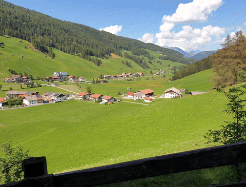

# isekai-live

[English README](./README.md)

从一张指定静态图和一段指定视频出发，构建 Live Photo，并导出成 Photos 真正能导入的资产。



上面这张演示图对应的真实产物是：

- 封面图：`tmp/qwen-test/test.jpeg`
- 风格化视频：`tmp/qwen-test/stylized.mp4`
- 最终 Live Photo 包：`tmp/qwen-demo-live-original/livephoto.pvt`

如果只看表面，这个工具做的事情很简单：

- 选一张你想让别人先看到的封面图
- 选一段你想在长按时播放的视频
- 构建或 remix 成新的 Live Photo
- 导入 Photos，验证它是不是你真正想要的结果

它不是完整的图片编辑器或视频编辑器，而是一个偏创作工作流的 CLI。

## 这件事为什么有意思

大多数 Live Photo 工具，要么偏拍摄，要么偏底层元数据写入。

`isekai-live` 想做得更具体一点：它允许你把封面和动态内容解耦。

这意味着你可以做这样的东西：

- 用一张 AI 头像做封面，长按后播放真人自拍视频
- 用一张修复后的老照片做封面，长按后播放家庭片段
- 用一张宠物插画做封面，长按后播放宠物真实视频

这样做出来的就不只是“一张会动的照片”，而是一个被重新设计过的预览到展开的体验。

## CLI 能做什么

- `build`：由图片 + 视频构建 Live Photo
- `extract`：从已有 Live Photo 中提取封面和视频
- `remix`：替换其中一侧并重新构建
- `ai-cover`：从已有封面生成新的风格化图片
- `ai-video`：把已有视频做成风格化版本

## 当前状态

- `build`、`extract`、`remix`：已实现
- `ai-cover --provider qwen`：已实现
- `ai-video --provider qwen`：已实现
- `ai-cover --provider gemini`：CLI 接口已预留，实际 API 还未实现
- `png` 封面可直接输入；在 `build` / `remix` 时会按需自动转成 `jpeg`

## 安装

```bash
git clone https://github.com/farmcan/isekai-gate.git
cd isekai-gate
pip install -e .
```

环境要求：

- Python `>= 3.14`
- 推荐 macOS
- 如果要用 Qwen AI 封面生成，需要 DashScope API key（`sk-...`）

## 快速开始

准备素材：

```text
assets/
├── cover.jpg
└── clip.mov
```

构建 Live Photo：

```bash
isekai-live build \
  --cover assets/cover.jpg \
  --video assets/clip.mov \
  --output-dir output
```

典型输出：

```text
Image: output/livephoto.jpg
Video: output/livephoto.mov
Package: output/livephoto.pvt
Asset ID: xxxxxxxx-xxxx-xxxx-xxxx-xxxxxxxxxxxx
```

导入到 macOS Photos：

```bash
open output/livephoto.pvt
```

## 两个最有代表性的例子

给已有 Live Photo 换一张封面：

```bash
isekai-live remix \
  --input original.jpg \
  --new-cover new_cover.jpg \
  --output-dir remixed/
```

先用 Qwen 生成新封面，再重新打包回 Live Photo：

```bash
isekai-live extract --input original.jpg --output-dir assets/

isekai-live ai-cover \
  --input assets/cover.jpg \
  --prompt "把这张照片改成高质量卡通插画风格，保留主体构图与姿态，颜色明快，细节干净，适合做 Live Photo 封面" \
  --provider qwen \
  --qwen-key YOUR_DASHSCOPE_API_KEY \
  --output ai_cover.png

isekai-live remix \
  --input original.jpg \
  --new-cover ai_cover.png \
  --output-dir remixed/

open remixed/livephoto.pvt
```

用 Qwen 给现有视频做风格化：

```bash
isekai-live ai-video \
  --input-video clip.mov \
  --style anime \
  --provider qwen \
  --qwen-key YOUR_DASHSCOPE_API_KEY \
  --output stylized.mp4
```

完整 AI 工作流：原图封面 + 风格化视频 -> Live Photo：

```bash
isekai-live ai-video \
  --input-video test.mov \
  --style anime \
  --provider qwen \
  --qwen-key YOUR_DASHSCOPE_API_KEY \
  --output stylized.mp4

isekai-live build \
  --cover test.jpeg \
  --video stylized.mp4 \
  --output-dir output

open output/livephoto.pvt
```

## Live Photo 其实是什么

从用户视角看，Live Photo 像一张会动的照片。

从实现角度看，它更像一组配对资产：

- 一张静态图片负责预览
- 一段短视频负责动态内容
- 两者共享同一个标识，Photos 才会把它们识别为同一条 Live Photo

所以，光是本地生成了文件还不够。真正的验收标准，是 Photos 能不能导入并正确播放。

## 如何验证结果

验证至少要分两层：

1. 资产层验证
- 确认生成了 `livephoto.jpg`、`livephoto.mov`、`livephoto.pvt`
- 确认图片和视频属于同一个 Live Photo 资产
- 确认能用 `extract` 反向提取出配对结果

2. Photos 层验证
- 把 `.pvt` 导入 macOS Photos
- 确认 Photos 将其识别为 Live Photo
- 确认长按或播放时行为正确

为什么必须这样验证：命令跑完了，并不等于 Apple Photos 会把它当成真正可用的 Live Photo。

## AI 封面说明

- Qwen 走阿里云 DashScope 图生图接口
- `ai-video` 走 Qwen 视频风格化接口
- 可以通过 `--qwen-key` 传 key，也可以设置 `QWEN_API_KEY`
- 生成结果会直接写入 `--output`
- 如果输出是 `png`，后续 `build` 或 `remix` 会自动转成 `jpeg` 再打包

## 官方测试素材

```bash
curl -LO https://raw.githubusercontent.com/RhetTbull/makelive/main/tests/test.jpeg
curl -LO https://raw.githubusercontent.com/RhetTbull/makelive/main/tests/test.mov

# 最基础的构建（风格化图片 + 原视频）
isekai-live build --cover test.jpeg --video test.mov --output-dir output
open output/livephoto.pvt

# 原图封面 + 风格化视频
isekai-live ai-video \
  --input-video test.mov \
  --style anime \
  --provider qwen \
  --qwen-key YOUR_DASHSCOPE_API_KEY \
  --output stylized.mp4

isekai-live build --cover test.jpeg --video stylized.mp4 --output-dir output-ai-video
open output-ai-video/livephoto.pvt
```

来源：[`makelive/tests`](https://github.com/RhetTbull/makelive/tree/main/tests)

## 实现说明

这个项目依赖 [`makelive`](https://github.com/RhetTbull/makelive) 完成 Live Photo 元数据写入和 `.pvt` 打包。

这点是明确且有意为之的。这个项目真正补的是围绕它的工作流：

- 清晰的 CLI 入口
- 可复现的输出结果
- `extract / remix` 的闭环
- AI 封面生成再回流到 Live Photo 打包

## License

MIT
